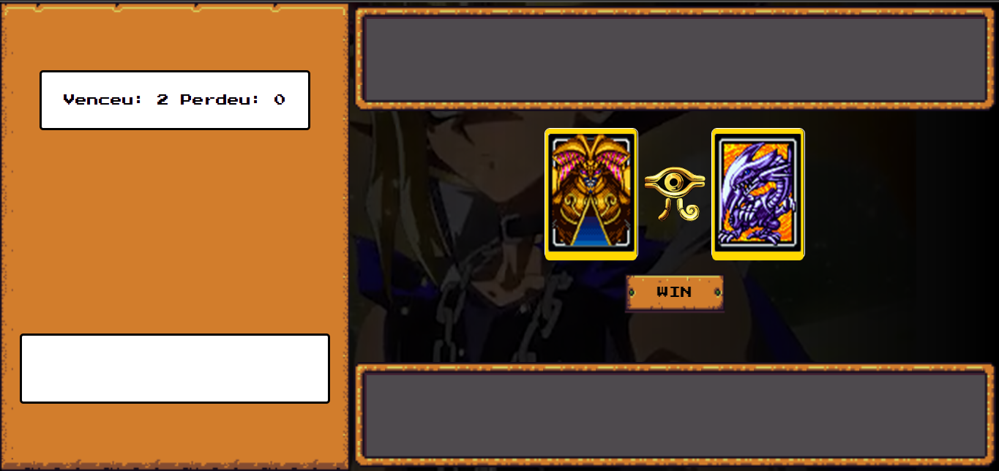

# PROJETO YU-GI-OH JO-KEN-PO

> Projeto foi desenvolvido durante o Bootcamp Potência Tech Ifood - desenvolvimento de jogos, em parceria com a DIO e consiste no desenvolvimento de um jogo de jo-ken-po baseado no desenho do yu-gi-oh, onde o usuário recebe 5 cartas com os respectivos atributos de pedra, papel e tesoura e ao escolher é comparado com a carta do usuário para definir o vencedor..

### Ajustes e melhorias

O projeto está finalizado mas aberto a críticas, elogios e sugestões.

## 💻 Pré-requisitos

Antes de começar, verifique se você atendeu aos seguintes requisitos:

- Um navegador instalado

## ☕ Utilizando o YU-GI-OH JO-KEN-PO:

Para utilizar o YU-GI-OH JO-KEN-PO siga estas etapas:

- Abra o link: https://maurochavesjr.github.io/yu-gi-oh/

## 🤝 Colaboradores

Agradecemos às seguintes pessoas que contribuíram para este projeto:

<table>
  <tr>
    <td align="center">
      <a href="#" title="defina o titulo do link">
         
        
          <b>Mauro Chaves</b>
        
      </a>
    </td>
  </tr>
</table>

